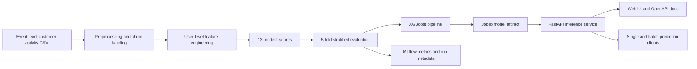

# Customer Churn Prediction Service

An end-to-end machine learning portfolio project that converts event-level subscription activity into user-level churn signals, evaluates an XGBoost classifier with out-of-fold predictions, and serves single or batch inference through FastAPI.

The project demonstrates the engineering path from raw behavioral events to an API-backed prediction experience. It is a local reference implementation, not a deployed production service.

## What this project demonstrates

| Area | Implementation |
| --- | --- |
| Data pipeline | Timestamp normalization, missing-value handling, cancellation-based labels, and user-level aggregation |
| Feature engineering | 13 engagement, recency, feedback, tenure, and subscription features |
| Model development | Scikit-learn `Pipeline` with `StandardScaler` and `XGBClassifier` |
| Evaluation | Shuffled 5-fold stratified cross-validation with out-of-fold predictions |
| Experiment tracking | Local MLflow runs for parameters, metrics, and confusion-matrix counts |
| Serving | Typed FastAPI endpoints for single prediction, batch prediction, health, metrics, model metadata, and feature importance |
| User experience | Lightweight browser interface plus autogenerated OpenAPI documentation |
| Quality guardrails | Focused predictor tests, development dependencies, CI, and a Docker build path |

## Evaluation snapshot

The repository's documented evaluation snapshot reports:

| Metric | Score |
| --- | ---: |
| ROC AUC | 0.9116 |
| Accuracy | 0.8889 |
| Precision | 0.8000 |
| Recall | 0.6923 |
| F1 score | 0.7423 |

These scores correspond to the evaluation approach implemented in `src/models/trainer.py`: predictions from five held-out stratified folds are combined before the metrics are calculated. The raw dataset, generated metrics file, and trained model are not committed, so this snapshot cannot currently be reproduced from a fresh clone without supplying compatible source data.

For a retention use case, recall deserves particular attention: a false negative represents a churner the intervention process would miss. The code records both false positives and false negatives so the operating threshold can be revisited against actual retention costs.

## Architecture



## Data contract

The pipeline expects an event-level CSV at:

```text
data/raw/processed_data.csv
```

The source file is not included. The preprocessing and feature code expects fields including `userId`, `sessionId`, `ts`, `registration`, `page`, `song`, `artist`, `length`, `level`, and basic user metadata. A user is labeled as churned when their history contains a `Cancellation Confirmation` event.

The engineered model inputs are:

```text
total_sessions
avg_session_duration
total_songs_played
avg_songs_per_session
thumbs_up_count
thumbs_down_count
add_playlist_count
add_friend_count
time_since_last_activity
days_since_registration
thumbs_up_ratio
thumbs_down_ratio
is_paid_user
```

Only use data you are authorized to process, and document its source and license when adding a reproducible sample.

## Run locally

### Prerequisites

- Python and `pip`
- A compatible event-level CSV

### 1. Create an environment

```bash
git clone https://github.com/mahmoudsabry3/customer_churn.git
cd customer_churn

python -m venv .venv
source .venv/bin/activate
python -m pip install --upgrade pip
python -m pip install -r requirements.txt
```

On Windows PowerShell, activate the environment with `.venv\Scripts\Activate.ps1`.

### 2. Add the input data and output directories

```bash
mkdir -p data/raw data/processed data/features models logs
cp /path/to/your/event_data.csv data/raw/processed_data.csv
```

### 3. Build the features and train the model

```bash
python scripts/full_pipeline.py
```

This writes the processed datasets, a serialized model, an evaluation report, and local MLflow run data to paths configured in `src/config/settings.py`.

### 4. Start the API

```bash
python main.py
```

Then open:

- Web interface: `http://localhost:8000`
- OpenAPI documentation: `http://localhost:8000/docs`
- Health endpoint: `http://localhost:8000/api/churn/health`

## API example

The model artifact must exist before calling a prediction or model-dependent health endpoint.

```bash
curl -X POST "http://localhost:8000/api/churn/predict" \
  -H "Content-Type: application/json" \
  -d '{
    "total_sessions": 10,
    "avg_session_duration": 3600.0,
    "total_songs_played": 100,
    "avg_songs_per_session": 10.0,
    "thumbs_up_count": 20,
    "thumbs_down_count": 5,
    "add_playlist_count": 15,
    "add_friend_count": 8,
    "time_since_last_activity": 2,
    "days_since_registration": 30,
    "thumbs_up_ratio": 0.2,
    "thumbs_down_ratio": 0.05,
    "is_paid_user": 1
  }'
```

Example response shape:

```json
{
  "churn_prediction": 0,
  "churn_probability": 0.23,
  "no_churn_probability": 0.77
}
```

### Available endpoints

| Method | Path | Purpose |
| --- | --- | --- |
| `GET` | `/` | Local web interface |
| `POST` | `/api/churn/predict` | Predict one user |
| `POST` | `/api/churn/batch_predict` | Predict multiple users |
| `GET` | `/api/churn/health` | Confirm model loading |
| `GET` | `/api/churn/model/metrics` | Read the saved evaluation metrics |
| `GET` | `/api/churn/model/info` | Inspect model metadata |
| `GET` | `/api/churn/feature_importance` | Read XGBoost feature importances |

## Inspect experiments

Training uses a local file-backed MLflow store:

```bash
mlflow ui --backend-store-uri ./mlruns
```

Open `http://localhost:5000` to compare recorded runs.

## Run the tests

Install the development dependencies and run the focused predictor input-validation suite:

```bash
python -m pip install -r requirements-dev.txt
python -m pytest
```

The CI workflow runs the tests and compiles the source files on repository changes. The current suite establishes a starting point around input validation; data, training, and API contract coverage remain future work.

## Build the container

```bash
make docker-build
make docker-run
```

The image packages the local API service. `make docker-run` mounts the local `models/` directory read-only, so train the model before starting the container. A production deployment should replace this local mount with an explicit artifact-delivery workflow.

## Repository structure

```text
.
├── .github/
│   └── workflows/
├── tests/
├── Dockerfile
├── main.py
├── scripts/
│   ├── data_pipeline.py
│   ├── train_model.py
│   └── full_pipeline.py
├── src/
│   ├── api/
│   ├── config/
│   ├── data/
│   ├── models/
│   └── utils/
├── static/
│   └── index.html
├── Makefile
├── requirements.txt
└── requirements-dev.txt
```

## Verification status and limitations

The implemented pipeline and API provide a solid local vertical slice, but several items remain before production use:

- The dataset, trained model, and detailed evaluation artifacts are not committed; the published scores need a reproducible data source and captured run.
- The focused predictor tests and CI do not yet cover preprocessing, feature engineering, training, FastAPI contracts, or the end-to-end pipeline.
- The Dockerfile provides repeatable local packaging, but no production deployment, artifact promotion, or container security policy is configured.
- `avg_songs_per_session` currently divides song plays by the number of unique songs, not by sessions; the feature name and calculation should be reconciled.
- `days_since_registration` is currently derived from the first observed event rather than the `registration` field.
- The API defaults to reload mode, allows every CORS origin, and has no authentication, authorization, rate limiting, or deployment monitoring.
- MLflow uses local filesystem storage; no remote artifact store or model registry workflow is configured.
- No license file is currently included.

These gaps are intentionally documented so future iterations can be evaluated against clear engineering criteria rather than a broad "production-ready" claim.

## Next engineering steps

1. Add a small, licensed sample dataset or a deterministic synthetic-data generator.
2. Correct and test the two feature-definition mismatches above.
3. Expand automated coverage to preprocessing, training, API contracts, and an end-to-end fixture.
4. Capture dataset version, code revision, metrics, and confusion matrix in a reproducible MLflow run.
5. Add threshold selection based on retention economics and probability calibration.
6. Harden container startup, dependency scanning, artifact delivery, and production configuration.
